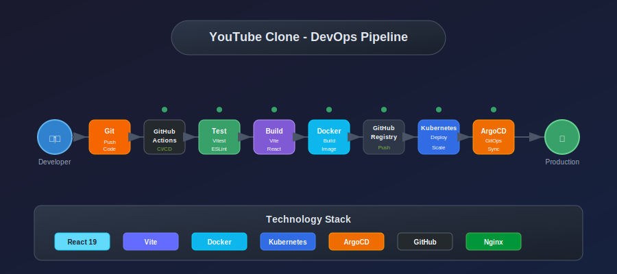
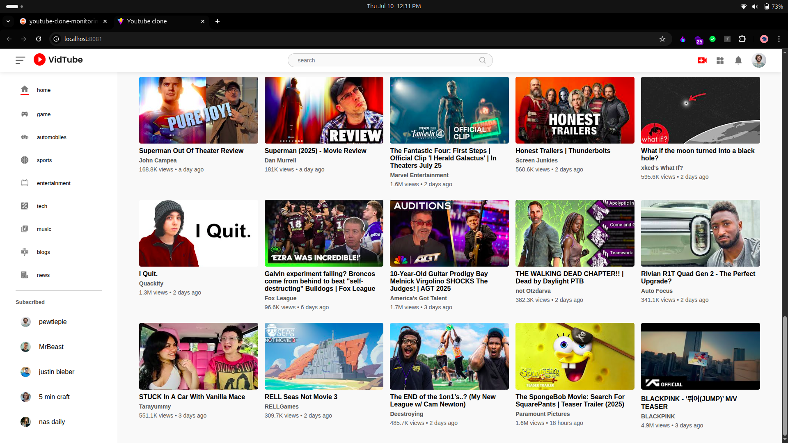

# YouTube Clone - Enterprise DevOps Implementation

A React-based YouTube clone application with complete CI/CD pipeline, containerization, and Kubernetes deployment.

## 📊 DevOps Pipeline



## 🎬 YouTube Clone Application



## 🏗️ Architecture

This project uses a **multi-stage Docker build** approach:

1. **Builder Stage**: Node.js Alpine image for building the React application
2. **Production Stage**: Nginx Alpine image for serving the built application
3. **Development Stage**: Node.js Alpine image for development with hot reload

## 📁 Project Structure

```
youtube-clone/
├── src/                    # React source code
│   ├── Components/         # React components
│   ├── Pages/             # Page components
│   ├── assets/            # Static assets
│   ├── test/              # Test files
│   ├── App.jsx            # Main App component
│   └── main.jsx           # Entry point
├── public/                # Public assets
├── infrastructure/        # DevOps configurations
│   ├── docker/           # Docker configurations
│   │   ├── docker-compose.yml
│   │   ├── Dockerfile
│   │   └── nginx.conf
│   ├── k8s/              # Kubernetes manifests
│   │   ├── base/         # Base configurations
│   │   ├── overlays/     # Environment overlays
│   │   ├── monitoring/   # Monitoring setup
│   │   └── infrastructure/
│   └── argocd-application.yaml
├── scripts/              # Build and deployment scripts
│   └── Makefile         # Docker management commands
├── docs/                 # Documentation and assets
│   ├── assets/          # Images and diagrams
│   └── diagrams/        # Architecture diagrams
├── .github/             # CI/CD workflows
│   └── workflows/       # GitHub Actions
├── package.json         # Node.js dependencies
└── README.md           # This file
```

## 🚀 Quick Start

### Prerequisites
- Docker installed on your system
- Docker Compose (optional, for easier management)

### Option 1: Using Docker Commands

#### Build and Run Production
```bash
# Build the production image
docker build -f infrastructure/docker/Dockerfile -t youtube-clone:latest --target production .

# Run the container
docker run -d -p 8080:8080 --name youtube-clone-app youtube-clone:latest

# Access the application
open http://localhost:8080
```

#### Run Development Mode
```bash
# Build development image
docker build -f infrastructure/docker/Dockerfile -t youtube-clone:dev --target development .

# Run development container with volume mounting
docker run -d -p 5173:5173 -v $(pwd):/app -v /app/node_modules --name youtube-clone-dev youtube-clone:dev

# Access development server
open http://localhost:5173
```

### Option 2: Using Docker Compose

#### Production Mode
```bash
# Start production container
docker-compose -f infrastructure/docker/docker-compose.yml up -d youtube-clone-prod

# Access the application
open http://localhost:8080
```

#### Development Mode
```bash
# Start development container
docker-compose -f infrastructure/docker/docker-compose.yml --profile dev up -d youtube-clone-dev

# Access development server
open http://localhost:5173
```

### Option 3: Using Makefile

```bash
# Navigate to scripts directory
cd scripts/

# Build production image
make build

# Run production container
make run

# Run development container
make dev

# Stop all containers
make stop

# Clean up containers and images
make clean

# View logs
make logs

# Check health
make health

# Access container shell
make shell
```

## 🐳 Docker Configuration

### Multi-Stage Dockerfile Benefits

1. **Optimized Image Size**: Production image only contains built assets and nginx
2. **Security**: No source code or build tools in production image
3. **Caching**: Efficient layer caching for faster rebuilds
4. **Flexibility**: Separate targets for development and production

### Production Stage Features

- **Base Image**: nginx:alpine (lightweight)
- **Security Headers**: XSS protection, content type options, etc.
- **Gzip Compression**: Enabled for better performance
- **SPA Routing**: Configured for React Router
- **Health Checks**: Built-in health monitoring
- **Cache Control**: Optimized caching strategy

### Development Stage Features

- **Hot Reload**: Live code changes
- **Volume Mounting**: Source code synchronization
- **Debug Mode**: Full development environment

## 🔧 Configuration Files

### nginx.conf
- Optimized for Single Page Applications
- Security headers implementation
- Gzip compression
- Static asset caching
- Health check endpoint

### docker-compose.yml
- Production and development services
- Network configuration
- Volume management
- Health checks

### .dockerignore
- Excludes unnecessary files from build context
- Reduces build time and image size

## 📊 Container Management

### Health Monitoring
```bash
# Check container health
docker ps
curl http://localhost:8080/

# View detailed health status
docker inspect youtube-clone-app | grep -A 10 Health
```

### Logs and Debugging
```bash
# View container logs
docker logs youtube-clone-app

# Follow logs in real-time
docker logs -f youtube-clone-app

# Access container shell
docker exec -it youtube-clone-app sh
```

### Performance Monitoring
```bash
# Check container resource usage
docker stats youtube-clone-app

# View container processes
docker top youtube-clone-app
```

## 🛠️ Troubleshooting

### Common Issues

1. **Port Already in Use**
   ```bash
   # Check what's using port 8080
   sudo lsof -i :8080
   
   # Use different port
   docker run -d -p 8081:8080 --name youtube-clone-app youtube-clone:latest
   ```

2. **Build Failures**
   ```bash
   # Clean Docker cache
   docker system prune -a
   
   # Rebuild without cache
   docker build --no-cache -t youtube-clone:latest .
   ```

3. **Container Won't Start**
   ```bash
   # Check logs for errors
   docker logs youtube-clone-app
   
   # Inspect container configuration
   docker inspect youtube-clone-app
   ```

## 🔒 Security Considerations

- Non-root user execution in container
- Security headers implemented
- Minimal attack surface with Alpine Linux
- No sensitive data in image layers
- Regular base image updates recommended

## 📈 Performance Optimizations

- Multi-stage builds for smaller images
- Gzip compression enabled
- Static asset caching
- Efficient layer caching
- Health checks for monitoring

## 🚀 Production Deployment

For production deployment, consider:

1. **Reverse Proxy**: Use nginx or traefik as reverse proxy
2. **SSL/TLS**: Implement HTTPS with Let's Encrypt
3. **Monitoring**: Add logging and monitoring solutions
4. **Scaling**: Use Docker Swarm or Kubernetes for scaling
5. **CI/CD**: Implement automated build and deployment pipelines

## 📝 Development Workflow

1. Make code changes in `src/` directory
2. For development: Changes are automatically reflected (hot reload)
3. For production: Rebuild image and restart container
4. Test changes using health checks and manual testing

## 🤝 Contributing

1. Fork the repository
2. Create a feature branch
3. Make your changes
4. Test with Docker
5. Submit a pull request

## 📄 License

This project is licensed under the MIT License.

---

**Built with ❤️ using React, Vite, Docker, and Nginx**
